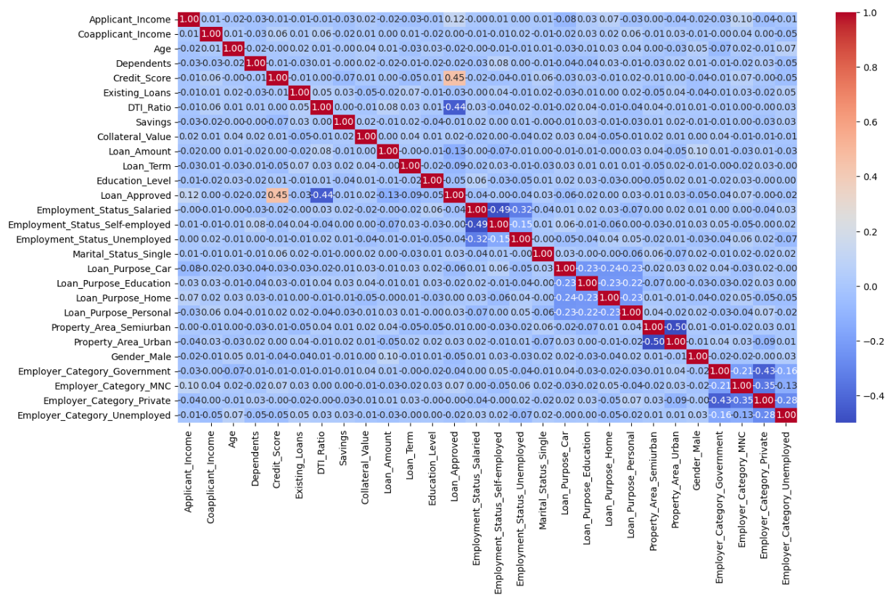
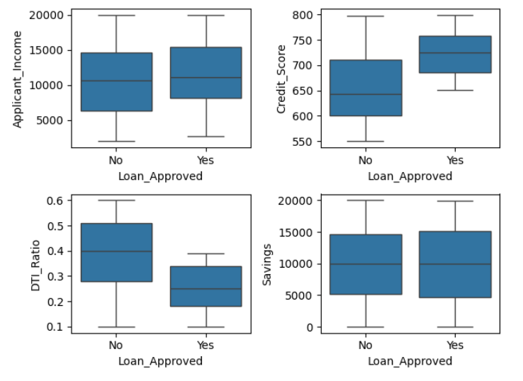
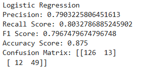

# 💳 Credit Wise Loan System

## 📌 Project Overview

The **Credit Wise Loan System** is a Machine Learning-based loan approval prediction project developed to analyze applicant financial and personal details and predict whether a loan application should be approved or rejected.

This project demonstrates the complete Machine Learning workflow including:

- Data Cleaning
- Missing Value Handling
- Exploratory Data Analysis (EDA)
- Data Visualization
- Feature Engineering
- Encoding
- Feature Scaling
- Model Training & Evaluation

The system evaluates applicant risk factors such as income, savings, debt-to-income ratio, education level, employment status, credit score, and other financial indicators.

---

# 🎯 Objective

The objective of this project is to build an intelligent loan approval prediction system that helps financial institutions automate the loan approval process using Machine Learning algorithms.

---

# 🧠 Technologies Used

- Python
- Pandas
- NumPy
- Matplotlib
- Seaborn
- Scikit-learn
- Jupyter Notebook

---

# 📂 Dataset Information

| Attribute | Details |
|---|---|
| Dataset Name | Loan Approval Dataset |
| Source | Kaggle |
| Type | Financial Dataset |
| Total Features | 27 |
| Target Variable | Loan_Approved |

---

# ⚙️ Machine Learning Workflow

## 1️⃣ Importing Libraries

Imported required libraries for:
- data analysis,
- visualization,
- preprocessing,
- model training,
- evaluation.

---

## 2️⃣ Handling Missing Values

Performed missing value detection and treatment to ensure clean and reliable data for training.

---

## 3️⃣ Exploratory Data Analysis (EDA)

Performed detailed exploratory data analysis to understand dataset patterns and applicant behavior.

### EDA Includes:

- Class balance analysis using pie chart
- Education level category analysis
- Applicant income analysis
- Coapplicant income analysis
- Credit score analysis
- Loan approval comparison graphs
- Outlier detection using boxplots
- Financial distribution analysis

---

# 📊 Data Visualizations

## ✔ Loan Approval Distribution

Analyzed whether the dataset is balanced or imbalanced using:
- Pie Plot
- Count Plot

---

## ✔ Income Analysis

Performed:
- Applicant income distribution analysis
- Coapplicant income analysis

---

## ✔ Credit Score Analysis

Compared:
- Credit Score vs Loan Approval

Higher credit scores showed higher probability of loan approval.

---

## ✔ Outlier Detection

Used subplot boxplots for:
- Applicant Income
- Credit Score
- DTI Ratio
- Savings

to detect financial outliers and anomalies.

---

# 🔥 Feature Engineering

Created additional intelligent features to improve model performance.

## Added Features:

```python
DTI_Ratio_sq = DTI_Ratio ** 2
Credit_Score_sq = Credit_Score ** 2
```

These engineered features helped improve prediction capability and financial risk analysis.

---

# 🔄 Encoding

Performed encoding for categorical variables including:

- Education Level
- Loan Approved
- Employment Status
- Property Area
- Gender
- Loan Purpose
- Employer Category

Used:
- Label Encoding
- One Hot Encoding

---

# 🌡 Correlation Heatmap

Generated correlation heatmap to analyze relationships between features and identify highly correlated variables.

---

# ✂ Train-Test Split & Feature Scaling

Performed:

- Train-Test Split
- StandardScaler Feature Scaling

to normalize feature values and improve model efficiency.

---

# 🤖 Machine Learning Models Used

The following models were trained and evaluated:

---

## 🔹 Logistic Regression

| Metric | Score |
|---|---|
| Precision | 0.7903 |
| Recall | 0.8032 |
| F1 Score | 0.7967 |
| Accuracy | 87.5% |

### Confusion Matrix

```python
[[126  13]
 [ 12  49]]
```

---

## 🔹 KNN Model

| Metric | Score |
|---|---|
| Precision | 0.6200 |
| Recall | 0.5081 |
| F1 Score | 0.5585 |
| Accuracy | 75.5% |

### Confusion Matrix

```python
[[120  19]
 [ 30  31]]
```

---

## 🔹 Naive Bayes

| Metric | Score |
|---|---|
| Precision | 0.8035 |
| Recall | 0.7377 |
| F1 Score | 0.7692 |
| Accuracy | 86.5% |

### Confusion Matrix

```python
[[128  11]
 [ 16  45]]
```

---

# 🏆 Best Performing Model

Based on overall performance and precision:

## ✅ Logistic Regression

achieved the best balance between:
- precision,
- recall,
- F1-score,
- and accuracy.

---

# 📸 Project Screenshots

## ✔ Correlation Heatmap



---

## ✔ Outlier Analysis



---

## ✔ Model Evaluation Results



---

# 📁 Project Structure

```bash
Credit-Wise-Loan-System/
│
├── model_training.ipynb
├── loan_approval_data.csv
├── model.pkl
├── requirements.txt
├── README.md
├── .gitignore
└── screenshots/
```

---

# 👨‍💻 Developer Information

| Attribute | Details |
|---|---|
| Developed By | Pranjal Sharma |
| Roll Number | 245UAI140 |
| College | Gautam Buddha University |
| Program | B.Tech CSE with AI |
| Academic Year | 2025-26 |

---

# 🚀 Future Improvements

- Real-time Loan Prediction Web App
- Advanced Credit Scoring System
- Deep Learning Integration
- Cloud Deployment
- Financial Fraud Detection Integration

---

# ⭐ Conclusion

This project demonstrates the practical implementation of Machine Learning in financial loan approval systems. The project successfully analyzes financial risk indicators and predicts loan approval using multiple classification algorithms and feature engineering techniques.

The project highlights the importance of:
- data preprocessing,
- feature engineering,
- model comparison,
- and evaluation metrics

in building intelligent financial prediction systems.